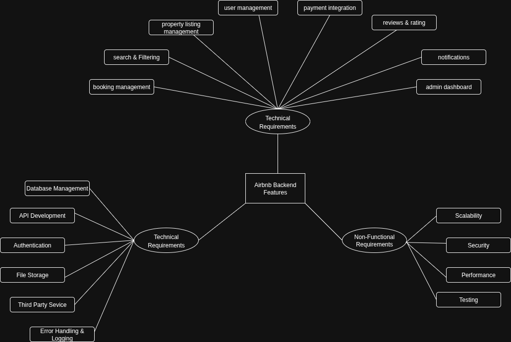

# Airbnb Backend Features and Functionalities

This document outlines the key backend features required to build the Airbnb Clone system.  
It covers **core functionalities**, **technical requirements**, and **non-functional requirements**.

## 📊 Features Diagram
Below is the feature hierarchy diagram:

---

## 🔑 Core Functionalities
- User Management: registration, login (JWT + OAuth), profile updates
- Property Listings: create, edit, delete, manage availability
- Search & Filtering: by location, price, guests, amenities
- Booking Management: create/cancel bookings, track statuses
- Payments: guest payments, host payouts, Stripe/PayPal integration
- Reviews & Ratings: linked to bookings, host responses
- Notifications: email + in-app (booking, payment, cancellations)
- Admin Dashboard: manage users, listings, bookings, payments

## 🛠️ Technical Requirements
- Relational database (PostgreSQL/MySQL)
- RESTful API design (optional GraphQL)
- JWT authentication + RBAC
- File storage for images (AWS S3/Cloudinary)
- Third-party email service (SendGrid/Mailgun)
- Error handling & logging

## 🚀 Non-Functional Requirements
- Scalability: modular design, load balancing
- Security: encryption, firewalls, rate limiting
- Performance: Redis caching, optimized queries
- Testing: unit, integration, automated API tests
