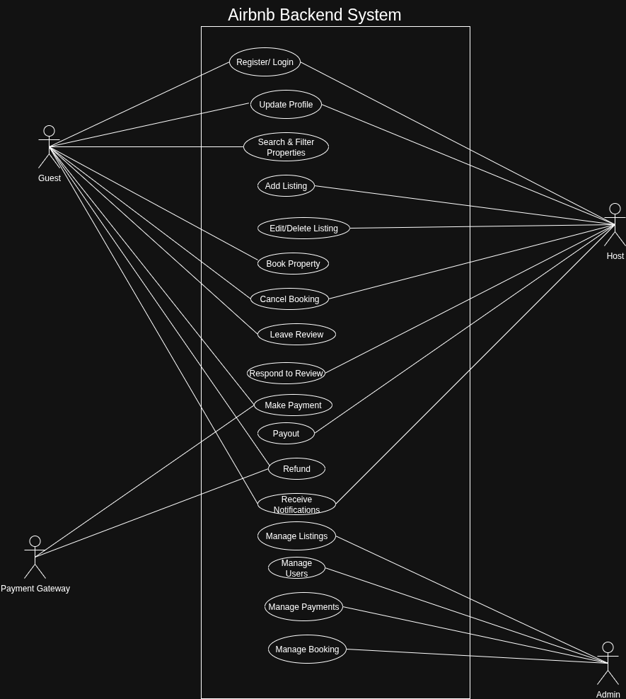

# Use Case Diagram - Airbnb Backend

This diagram illustrates the interactions between **actors** (Guest, Host, Admin, Payment Gateway) and the **Airbnb Backend System**.  

## 🎭 Actors
- **Guest**: Registers, books properties, makes payments, leaves reviews.  
- **Host**: Manages property listings, responds to reviews, receives payouts.  
- **Admin**: Manages users, listings, bookings, and payments.  
- **Payment Gateway (Stripe/PayPal)**: Handles payments and refunds.  

## 📊 Use Case Diagram

